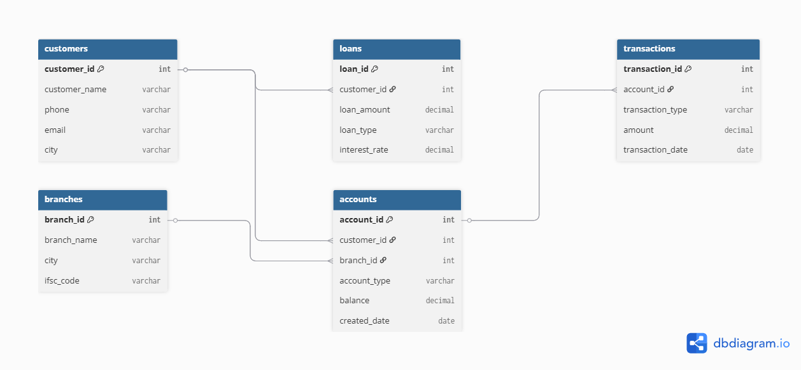

# Banking Management Database

## Features
- Customer records
- Account management
- Transaction handling

## SQL Concepts
- Joins
- Primary Keys
- Foreign Keys
- Aggregate Functions

## Tech Stack
- MySQL

## ER Diagram

