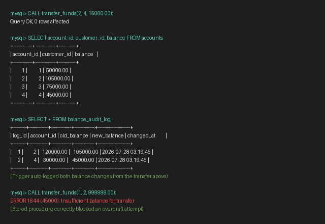

# Banking Management Database System

A relational database system built in MySQL to manage customer records, accounts, and transactions — including advanced features like stored procedures, triggers, and multi-table views, simulating real-world back-end banking workflows.

## Features

### Core
- Customer, account, and transaction data modeling with linked tables
- Referential integrity enforced through foreign keys and `ON DELETE CASCADE`
- Check constraint preventing negative account balances

### Advanced
- **Views** — `customer_account_summary`, `high_value_customers`, and `transaction_history_detailed` for multi-table reporting without repeating complex joins
- **Stored Procedure** — `transfer_funds(from_account, to_account, amount)` performs a safe, atomic fund transfer using `START TRANSACTION` / `COMMIT` / `ROLLBACK`, with row locking (`FOR UPDATE`) and a guard against overdrafts
- **Trigger** — `trg_balance_audit` automatically logs every balance change to a `balance_audit_log` table, so no code outside the database can silently change a balance without being tracked
- **Indexes** — added on foreign key and date columns to keep reporting queries fast as data grows

## Tech Stack

- **Database:** MySQL 8.0
- **Concepts used:** Joins, Foreign Keys, Views, Stored Procedures, Triggers, Transactions (ACID), Indexing, Constraints

## Database Design

```
customers (customer_id, full_name, email, phone, address)
       │
       ▼
accounts (account_id, customer_id FK, account_type, balance)
       │
       ▼
transactions (transaction_id, account_id FK, transaction_type, amount, remarks)

balance_audit_log (log_id, account_id, old_balance, new_balance, changed_at)
   — populated automatically by trg_balance_audit
```

## Project Structure

```
banking-management-database/
├── setup.sql            # Schema, sample data, views, procedure, trigger
├── sample_queries.sql   # Reporting queries + procedure demo
├── sample_output.txt    # Real console output from running the above
├── sample_output_screenshot.png
└── README.md
```

## Setup & Running

1. **Install MySQL 8.0+**

2. **Run the setup script** (creates database, tables, sample data, views, procedure, trigger)
   ```bash
   mysql -u root -p < setup.sql
   ```

3. **Run the sample queries** to see reporting views and the transfer procedure in action
   ```bash
   mysql -u root -p --table < sample_queries.sql
   ```

## Sample Output

Real output from running `sample_queries.sql` against a live MySQL instance — includes a fund transfer via the stored procedure, the trigger auto-logging both balance changes, and the procedure correctly blocking an overdraft attempt:



Full raw output (all reporting queries) is available in [`sample_output.txt`](sample_output.txt).

## What This Project Demonstrates

- Relational database design with normalized tables and enforced constraints
- Writing multi-table joins and aggregate queries for reporting
- Building reusable views to simplify complex reporting logic
- Writing a stored procedure with transaction control (COMMIT/ROLLBACK) to keep a multi-step operation atomic and consistent
- Using a trigger to enforce auditing without relying on application-level code
- Applying indexing for query performance on foreign key and date columns

## Future Improvements

- Add role-based access control (read-only reporting user vs. admin user)
- Add a simple front-end (Python/Java) to interact with the database
- Add scheduled events for periodic interest calculation on savings accounts
